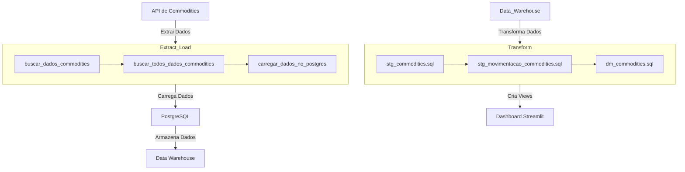
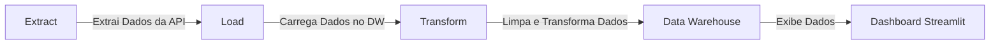

# Projeto de Data Warehouse de Commodities

Quanto sua empresa vendeu ontem?
Se você demorar mais de 3 segundos para responder esse workshop de hoje é para você!

Este projeto tem como objetivo criar um Data Warehouse (DW) para armazenar e analisar dados de commodities, utilizando uma arquitetura moderna de ETL (Extract, Transform, Load). O projeto inclui:

[Documentação do DBT](https://lvgalvao.github.io/workshop-aberto-dw-do-zero/#!/overview)

[Dashboard](https://lvgalvao-workshop-aberto-dw-do-zero-appapp-vp0gw4.streamlit.app/)

1. **Parte de Extract_Load**: Responsável por extrair dados de uma API e carregar diretamente no banco de dados PostgreSQL.
2. **Parte de Seed**: Utiliza seeds do DBT para carregar dados de movimentações de commodities a partir de arquivos CSV.
3. **Models**: Define as transformações de dados usando DBT, criando tabelas de staging e de datamart.
4. **Dashboard**: Implementado em Streamlit, exibe dados e visualizações das commodities a partir do Data Warehouse.

## Estrutura do Projeto

### 1. Extract_Load

A parte de `extract_load` é responsável por extrair dados de uma API e carregar diretamente no banco de dados PostgreSQL. O script `extract_load.py` realiza essa operação.

### 2. Seed

A parte de seed utiliza o DBT para carregar dados de movimentações de commodities a partir de arquivos CSV. Esses dados são carregados diretamente no Data Warehouse.

### 3. Models

Os models do DBT são usados para transformar os dados carregados em tabelas de staging e de datamart. As transformações incluem a limpeza dos dados e a criação de métricas agregadas.

### 4. Dashboard

O dashboard é implementado em Streamlit e permite visualizar os dados das commodities armazenados no Data Warehouse. Ele exibe tabelas e gráficos interativos para análise dos dados.

## Gráficos Mermaid

### Movimentação entre Sistemas

### Ideia de ETL

